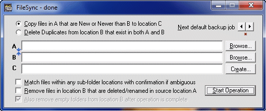



## FileSync Utility v5 Unicode Enabled

### Description

Simple synchronize backups and remove duplicates utility

Added option to remove empty folders after delete operations 

v3 adds the option to use file CRCs for exact matching - this helps 

in situations where time stamps are different when files are still identical. 

v4 updates the whole project to use the 'W' API functions to preserve unicode. 

v5 fixes a bug introduced in v4
 
### More Info
 

             |
---                |---
**Submitted On**   |2012-07-08 17:26:12
**By**             |[Rde](https://github.com/Planet-Source-Code/PSCIndex/blob/master/ByAuthor/rde.md)
**Level**          |Intermediate
**User Rating**    |5.0 (35 globes from 7 users)
**Compatibility**  |VB 5\.0, VB 6\.0
**Category**       |[Files/ File Controls/ Input/ Output](https://github.com/Planet-Source-Code/PSCIndex/blob/master/ByCategory/files-file-controls-input-output__1-3.md)
**World**          |[Visual Basic](https://github.com/Planet-Source-Code/PSCIndex/blob/master/ByWorld/visual-basic.md)
**Archive File**   |[FileSync\_U222579782012\.zip](https://github.com/Planet-Source-Code/rde-filesync-utility-v5-unicode-enabled__1-74356/archive/master.zip)

